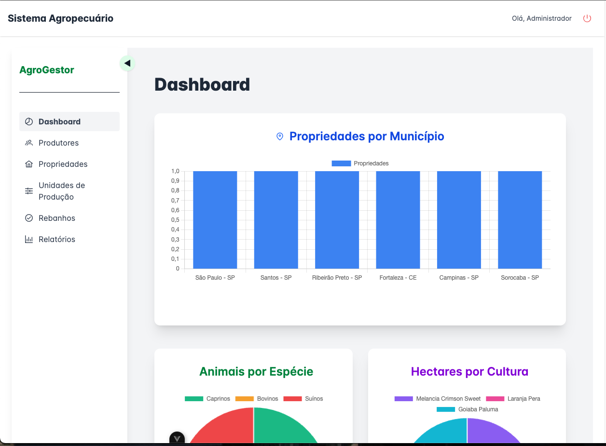
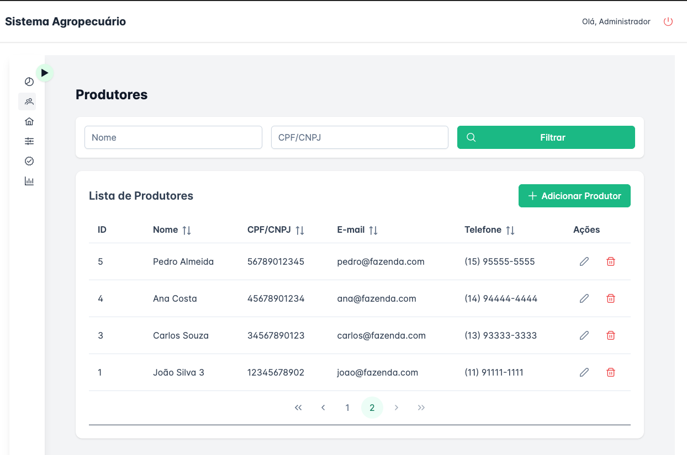
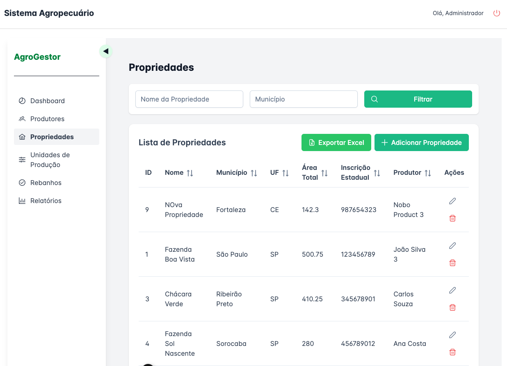
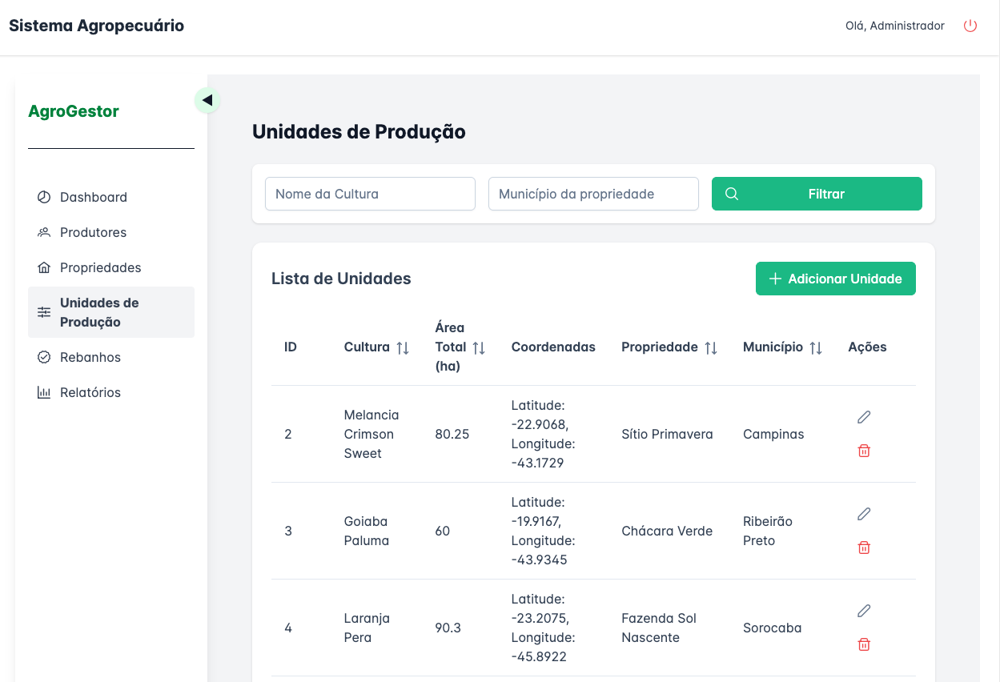
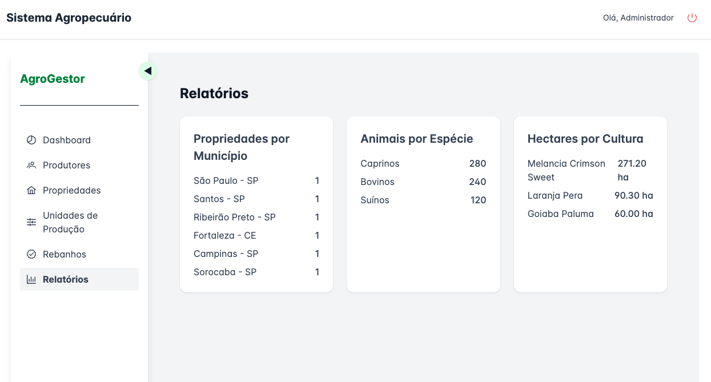

# AgroGestor

Sistema de gestão agropecuária construído em **Laravel 12 (backend)**, **PHP8.2** e **Vue 3 + TypeScript + PrimeVue (frontend)**, combinando robustez e uma interface moderna, conforme os requisitos do teste técnico.

---

## Telas do Sistema

Tela Dashboard


Tela de Produtores


Tela de Propriedades


Tela de Unidades de Produção


Tela de Rebanhos


Tela de Relatorios



## ✅ Funcionalidades Implementadas

### Backend (Laravel)
- CRUD completo para **Produtor Rural**, **Propriedade**, **Unidade de Produção** e **Rebanho**
- Relacionamentos 1:N entre entidades
- Autenticação segura com **Sanctum**
- Relatórios:
    - Total de propriedades por município
    - Total de animais por espécie
    - Total de hectares por cultura
- Exportação de dados:
    - Propriedades em **Excel (.xlsx)**
    - Rebanhos por produtor em **PDF**

### Frontend (Vue 3)
- Interface com **PrimeVue** + **Tailwind CSS**
- Filtros dinâmicos e paginação em todas as listagens
- Formulários com validação em tempo real
- Aplicação responsiva e intuitiva

---

## 🚀 Como rodar o projeto

### Pré-requisitos
- Docker e Docker Compose
- Git
- Navegador moderno (Chrome, Firefox, Edge)

### 1. Clone o repositório
```
git clone https://github.com/valdirmsjunior/agrogestor.git
cd agrogestor
```

### 2. Suba os containers
```
docker compose up -d
```

### Altere o .env
```
DB_CONNECTION=pgsql
DB_HOST=db
DB_PORT=5432
DB_DATABASE=agro_db
DB_USERNAME=agro_user
DB_PASSWORD=agro_pass
```

### 3. Execute as migrações e seeders no backend
```
docker exec -it agro_app php artisan migrate --seed
```

### 4. Execute o frontend
```
cd frontend
npm install
npm run dev
```

### 5. Acesse a aplicação
[http://localhost:5173/](http://localhost:5173/)

### 6. Credenciais de acesso

- **E-mail:** admin@agro.com  
- **Senha:** 1q2w3e

---

## 🗂️ Estrutura do Projeto

```
agrogestor/
├── backend/                  # Laravel API
│   ├── app/
│   │   ├── Http/Controllers/ # Controllers com Service + Repository
│   │   ├── Models/           # Models relacionais
│   │   ├── Services/         # Regras de negócio
│   │   └── Repositories/     # Acesso a dados
│   ├── database/seeders/     # Seeds de exemplo
│   └── routes/api.php        # Rotas REST
├── frontend/                 # Vue 3 + PrimeVue
│   ├── src/views/            # Listagens e formulários
│   ├── src/services/         # Consumo de APIs
│   └── src/composables/      # Hooks e lógica reutilizável
│   └── vite.config.ts        # Configuração Vite
├── docker/                   # Configuração Docker
│   ├── php/Dockerfile        # Imagem PHP customizada
│   └── nginx/default.conf    # Configuração Nginx
├── docker-compose.yml        # Orquestração dos serviços
└── README.md                 # Este arquivo
```

---

## 🛠️ Comandos Úteis

### Backend (Laravel via Docker)
- **Acessar container:**
  ```
  docker exec -it agro_app bash
  ```
- **Rodar migrações:**
  ```
  php artisan migrate
  ```
- **Rodar seeders:**
  ```
  php artisan db:seed
  ```
- **Ver logs:**
  ```
  docker logs agro_app
  ```

### Docker
- **Parar todos os serviços:**
  ```
  docker-compose down
  ```
- **Recriar containers:**
  ```
  docker-compose up -d --build
  ```
- **Ver status dos containers:**
  ```
  docker-compose ps
  ```

---

## 📝 Observações Importantes

- Todas as rotas de CRUD são protegidas por autenticação via Sanctum.
- Exportação em Excel e PDF feita diretamente no backend.
- Projeto modular: pode ser facilmente expandido com novas entidades e integrações.

---


## 📦 Versões Utilizadas 
```
Este projeto foi desenvolvido e testado com as seguintes versões:

Docker           24.0+
Docker Compose   v2.20+
PHP              8.2-fpm
Laravel          12.x
PostgreSQL       16-alpine
Nginx            stable-alpine (1.25.0)
Node.js          20-alpine
Vue.js           3.4.x
PrimeVue         3.50.x
Tailwind CSS     4.0.0-alpha.x
PostgreSQL (banco) 16

```